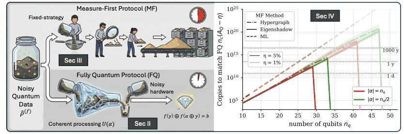
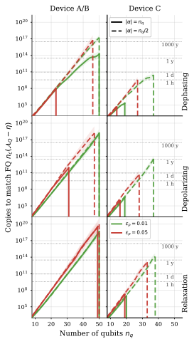

# Noisy Learning Advantage

[](https://arxiv.org/abs/2605.21346)
[](https://www.python.org/)
[](https://github.com/google/jax)
[](LICENSE)
[](CITATION.cff)
[](https://github.com/jaq-lab/noisy-learning-advantage)

> ⚠️ **Work in Progress** — This repository is under active development. Structure, APIs, and results may change without notice.

This repository contains simulations and analysis code for the paper:

> **"Evidence of Quantum Machine Learning Advantage with Tens of Noisy Qubits"**  
> Yash J. Patel, Riccardo Molteni, Evert van Nieuwenburg, Vedran Dunjko and Jan A. Krzywda [arXiv:2605.21346](https://arxiv.org/abs/2605.21346)  
> Investigating when and how quantum measurement protocols retain a learning advantage under realistic, hardware-level noise.


---

## Overview

The central question: *does a quantum shadow-tomography protocol still beat classical ML when the quantum device is noisy?*

The schematic below (Fig. 1 of the paper) illustrates the setup — a noisy quantum device produces measurement outcomes that are used to learn a target observable:



The main quantitative result (Fig. 5) shows the **number of samples needed** (`n_c`) to reach a target accuracy as a function of system size (`n_q`), comparing hypergraph, shadow-surrogate and ML baselines across dephasing and relaxation noise channels:



---

## Repository Structure

```
noisy-learning-advantage-3/
│
├── README.md                    ← this file
│
├── data/                        # All raw and processed data
│   ├── fig4_clean_m_vm_grids_nq*.json   # Pre-computed Vm grids (Fig. 4)
│   ├── old/                     # Archived older data
│   ├── curve_fitting/           # Curve-fitting scripts and CSV/JSON outputs
│   ├── ml_data/                 # ML training results (with/without HPO)
│   └── paper_data_2/            # Hypergraph, ML, and shadow-surrogate data
│
├── code/                        # All simulation and analysis code
│   ├── quantum_simulation/      # MC + DM quantum trajectory simulations
│   │   ├── README.md
│   │   ├── quantum_run_cluster_single_without_IS_readable.py  # main MC runner
│   │   ├── quantum_run_dm_verification.py
│   │   ├── shadow_mcs_jitted.py
│   │   ├── shadow_funcs_dm.py
│   │   └── modules/             # device config, noise channels, circuit helpers
│   └── shadows_simulation/      # JAX classical-shadow utilities + white-noise verification
│       ├── shadow_mcs_jitted.py
│       ├── shadow_funcs_dm.py
│       ├── classical_nn_run_light.py
│       ├── verify_white_noise_model.ipynb  ← white-noise model validation notebook
│       └── verify_white_noise_tests.py
│
└── manuscript/                  # Manuscript figures and notebooks
    ├── figures_notebooks/       # Jupyter notebooks that generate all figures
    │   ├── fig1_relaxation_main.ipynb
    │   ├── fig3_mf_protocols.ipynb
    │   ├── fig4_nps_nq_alpha_ch.ipynb
    │   ├── fig_mf_fixedacc_validation.ipynb
    │   ├── fig_mf_scaling_extrapolation.ipynb
    │   ├── fig_circuit_gate_analysis.ipynb
    │   ├── appB.ipynb
    │   └── appC.ipynb
    └── figures_manuscript/      # Final rendered figures (PDF/PNG)
        ├── Fig1_cartoon.pdf
        └── fig4_dephasing_relax.pdf
```

---

## Quick Start

### 1 — MC quantum simulation (cluster / local)

```bash
python3 code/quantum_simulation/quantum_run_cluster_single_without_IS_readable.py \
    --device S --channel relaxation \
    --nq 8 --nfk 10 --total_nf 10 \
    --alpha_pattern nq/2
```

### 2 — DM verification

```bash
python3 code/quantum_simulation/quantum_run_dm_verification.py \
    --device S --channel relaxation --nq 6
```

### 3 — Figure notebooks

Open any notebook under `manuscript/figures_notebooks/` in JupyterLab or VS Code.  
All notebooks resolve `REPO_ROOT` by walking up to the `.git` directory, so they work from any working directory.

---

## Key Dependencies

| Package | Purpose |
|---|---|
| **JAX** | GPU-accelerated trajectory sampling, JIT compilation |
| **TensorCircuit** | Quantum circuit simulation and shadow tomography |
| **NumPy / SciPy** | Data processing and curve fitting |
| **Matplotlib** | Plotting |
| **scikit-learn** | Logistic regression accuracy evaluation |

---

## Notes

- `shadows_simulation/` must remain a **sibling** of `quantum_simulation/` inside `code/` — import paths are relative to this layout.
- Outputs from cluster runs land in `code/quantum_simulation/cluster_results/` (not tracked by git).

---

## TODO

- [ ] **Refactor file names and locations** — consolidate `shadow_funcs_dm.py` (currently duplicated between `quantum_simulation/` and `shadows_simulation/`); rename scripts to follow a consistent convention; restructure `modules/` vs top-level files.
- [ ] **Upload data to Zenodo** — deposit `data/paper_data_2/`, `data/ml_data/`, and `data/curve_fitting/` outputs as a citable Zenodo dataset (DOI TBD).
- [ ] **Add hypergraph code** — integrate the hypergraph shadow-protocol implementation (currently lives outside this repository) alongside the existing shadow and ML baselines.
